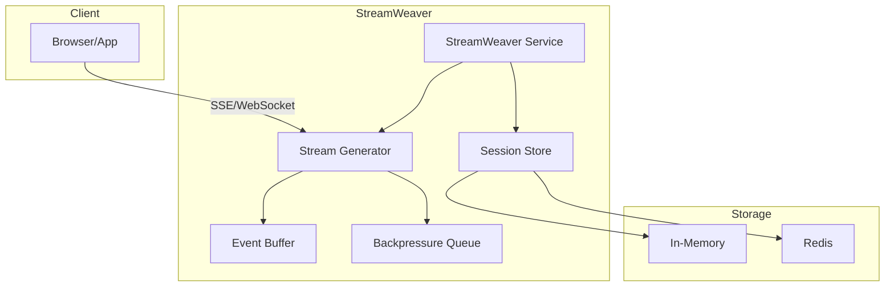

# StreamWeaver

Enterprise-grade Server-Sent Events (SSE) implementation for agentic AI workflows.

## Features

- **Simple API**: Easy to integrate with any async framework (FastAPI, Flask, etc.)
- **Session Management**: Built-in session tracking with pluggable storage backends
- **Event Streaming**: Real-time streaming of workflow events over SSE
- **Event Replay**: Automatic reconnection support with Last-Event-ID
- **Backpressure Handling**: Configurable overflow policies (DROP_OLDEST, DROP_NEWEST, BLOCK)
- **Event Filtering**: Filter events by visibility, type, or custom criteria
- **Observability**: Prometheus metrics for production monitoring
- **WebSocket Support**: Alternative transport for bidirectional communication
- **Event Batching**: Reduce overhead for high-frequency events
- **Redis Storage**: Production-ready distributed session storage

## Installation

```bash
pip install streamweaver

# With FastAPI integration
pip install streamweaver[fastapi]

# With Redis storage
pip install streamweaver[redis]

# With Prometheus metrics
pip install streamweaver[metrics]

# All optional dependencies
pip install streamweaver[all]
```

## Quick Start

```python
from contextlib import asynccontextmanager
from fastapi import FastAPI
from fastapi.responses import StreamingResponse
import uvicorn

from streamweaver import StreamWeaver, StreamEventType

weaver = StreamWeaver()

@asynccontextmanager
async def lifespan(app: FastAPI):
    await weaver.initialize()
    yield
    await weaver.shutdown()

app = FastAPI(lifespan=lifespan)

@app.post("/chat")
async def chat(message: str, session_id: str):
    await weaver.register_session(session_id, user_request=message)
    
    # Publish workflow events
    await weaver.publish(
        session_id=session_id,
        event_type=StreamEventType.WORKFLOW_STARTED,
        message="Processing..."
    )
    
    # ... do work ...
    
    await weaver.publish(
        session_id=session_id,
        event_type=StreamEventType.WORKFLOW_COMPLETED,
        message="Done!",
        data={"response": "Hello!"}
    )
    
    return {"session_id": session_id}

@app.get("/stream/{session_id}")
async def stream(session_id: str):
    stream_gen = await weaver.get_stream_response(session_id)
    return StreamingResponse(
        stream_gen,
        media_type="text/event-stream",
        headers={"Cache-Control": "no-cache"}
    )

if __name__ == "__main__":
    uvicorn.run(app, host="0.0.0.0", port=8000)
```

## Client Example (React)

```typescript
import { useEffect, useState } from 'react';

function AgentStream({ sessionId }: { sessionId: string }) {
  const [events, setEvents] = useState<any[]>([]);

  useEffect(() => {
    const eventSource = new EventSource(`/stream/${sessionId}`);
    
    eventSource.onmessage = (event) => {
      const data = JSON.parse(event.data);
      setEvents(prev => [...prev, data]);
    };
    
    return () => eventSource.close();
  }, [sessionId]);

  return (
    <div>
      {events.map((event, i) => (
        <div key={i}>{event.message}</div>
      ))}
    </div>
  );
}
```

## Architecture



## Core Concepts

### Events

StreamWeaver uses typed events for different stages of workflows:

| Event Type | Description |
|------------|-------------|
| `WORKFLOW_STARTED` | Workflow begins |
| `STEP_STARTED` | A step begins |
| `STEP_PROGRESS` | Progress update |
| `STEP_COMPLETED` | A step completes |
| `TOOL_EXECUTED` | A tool was used |
| `WORKFLOW_COMPLETED` | Workflow finished |
| `ERROR` | Something went wrong |
| `HEARTBEAT` | Connection health check |

### Event Visibility

Control who sees which events:

| Visibility | Description |
|------------|-------------|
| `USER_FACING` | Shown in UI and sent to model |
| `MODEL_ONLY` | Only for model memory |
| `LIVE_UI_ONLY` | Real-time UI only (e.g., reasoning tokens) |
| `INTERNAL_ONLY` | For server logs/debugging |

### Event Replay

Events are buffered for reconnection support. When a client reconnects with `Last-Event-ID`, missed events are automatically replayed:

```python
# Client sends Last-Event-ID header on reconnect
stream_gen = await weaver.get_stream_response(
    session_id,
    last_event_id="previous-event-uuid"
)
```

### Backpressure Handling

Configure how to handle slow consumers:

```python
from streamweaver import StreamWeaverConfig, BackpressurePolicy

config = StreamWeaverConfig(
    queue_size=1000,
    backpressure_policy=BackpressurePolicy.DROP_OLDEST,  # or DROP_NEWEST, BLOCK
)
```

### Event Filtering

Filter events before delivery:

```python
from streamweaver import VisibilityFilter, TypeFilter, EventVisibility, StreamEventType

# Only user-facing events
user_filter = VisibilityFilter(EventVisibility.USER_FACING)

# Exclude heartbeats
no_heartbeat = TypeFilter(StreamEventType.HEARTBEAT, include=False)

# Combine filters
combined = user_filter & no_heartbeat

stream_gen = await weaver.get_stream_response(session_id, event_filter=combined)
```

## Configuration

```python
from streamweaver import StreamWeaver, StreamWeaverConfig, BackpressurePolicy

config = StreamWeaverConfig(
    # Session settings
    session_timeout=3600,          # 1 hour
    max_concurrent_streams=1000,
    
    # Stream settings
    enable_heartbeat=True,
    heartbeat_interval=30,
    
    # Queue settings
    queue_size=1000,
    backpressure_policy=BackpressurePolicy.DROP_OLDEST,
    
    # Replay settings
    enable_replay=True,
    event_buffer_size=100,
    
    # Batching settings
    enable_batching=False,
    batch_size=10,
    batch_delay_ms=50,
    
    # Observability
    enable_metrics=False,
    metrics_prefix="streamweaver",
    
    # Compression
    enable_compression=False,
    compression_threshold=1024,
)

weaver = StreamWeaver(config)
```

## Redis Storage

For production deployments, use Redis for distributed session storage:

```python
from streamweaver import StreamWeaver
from streamweaver.storage import RedisSessionStore

redis_store = RedisSessionStore(
    redis_url="redis://localhost:6379",
    session_timeout=3600,
    key_prefix="streamweaver:session:",
    pool_size=10,
)

await redis_store.initialize()

weaver = StreamWeaver(session_store=redis_store)
await weaver.initialize()
```

## Observability

Enable Prometheus metrics:

```python
from streamweaver import StreamWeaverConfig

config = StreamWeaverConfig(
    enable_metrics=True,
    metrics_prefix="myapp_streamweaver",
)

weaver = StreamWeaver(config)
```

Available metrics:
- `streamweaver_events_published_total` - Counter of published events
- `streamweaver_events_dropped_total` - Counter of dropped events
- `streamweaver_active_sessions` - Gauge of active sessions
- `streamweaver_active_streams` - Gauge of active streams
- `streamweaver_queue_depth` - Gauge of queue depth per session
- `streamweaver_event_publish_duration_seconds` - Histogram of publish latency

## WebSocket Support

Use WebSocket as an alternative to SSE:

```python
from fastapi import FastAPI, WebSocket
from streamweaver import StreamWeaver
from streamweaver.integrations.websocket import WebSocketStreamHandler

weaver = StreamWeaver()
ws_handler = WebSocketStreamHandler(weaver)

@app.websocket("/ws/{session_id}")
async def websocket_endpoint(websocket: WebSocket, session_id: str):
    await ws_handler.handle_connection(websocket, session_id)
```

## Examples

See the `examples/` directory:

- `examples/basic/simple_agent.py` - Minimal chatbot example
- `examples/advanced/multi_step_workflow.py` - Multi-step research agent
- `examples/client/react_consumer.tsx` - React client implementation

## Testing

```bash
# Install dev dependencies
pip install streamweaver[dev]

# Run tests
pytest

# Run with coverage
pytest --cov=streamweaver --cov-report=html
```

## License

MIT License - see LICENSE file for details.

## Contributing

Contributions are welcome! Please read our contributing guidelines before submitting PRs.

## Roadmap

- [x] Event replay / resume support
- [x] Backpressure handling
- [x] Event filtering
- [x] Redis session storage
- [x] Prometheus metrics
- [x] WebSocket support
- [x] Event batching
- [ ] OpenTelemetry tracing
- [ ] Flask integration
- [ ] Event compression
- [ ] Dead letter queue

## Support

- GitHub Issues: https://github.com/okiynai/streamweaver/issues
- Documentation: https://github.com/okiynai/streamweaver#readme

---

Built with ❤️ by [Okiynai](https://okiynai.com)
